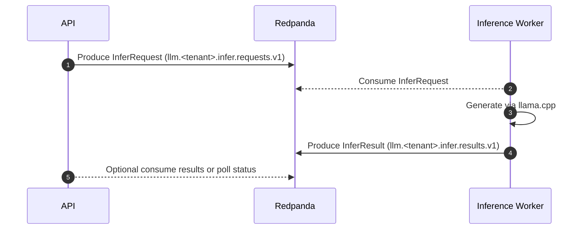
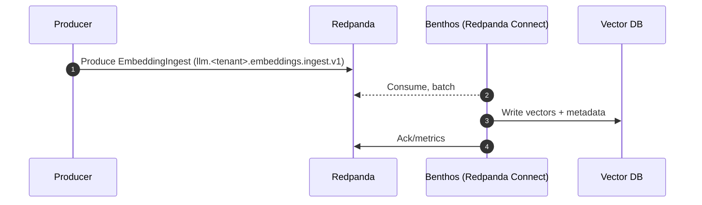
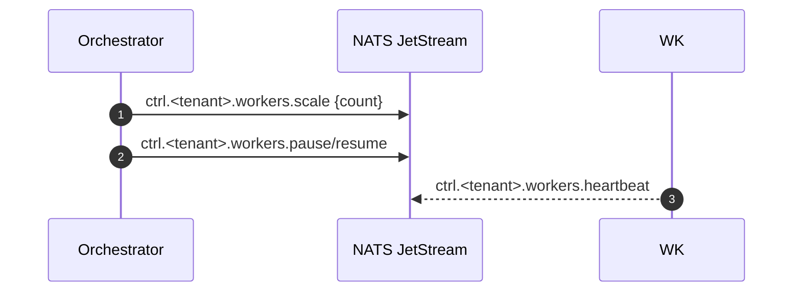

LLM-server Design

Models (Option A)
- R1: DeepSeek-R1-Distill-Qwen-32B (Q4_K_M)
- C1: Qwen2.5-14B-Instruct (Q4_K_M)
- J/V: Phi-4-mini-instruct (or Qwen2.5-7B) for judgers/verifiers

Speculative Decoding
- Use a fast 7–8B draft model to propose tokens and verify on the 32B model when beneficial.
- Fall back to direct decoding on 14B/32B for complex or safety-critical steps.

Limits and Concurrency
- Active windows: 32B → 48–64K, 14B → 24K, 7–8B → 16K.
- Concurrency: Analysis/Distillation = 1, Coder = 2, Verifiers = 3.
- Step cutoff: 8–15 seconds (use 12s default).

Routing Hints
- Router directs high-complexity tasks and global refactors to 32B.
- Coder uses 14B for most implementation tasks; escalates to 32B on hard constraints.
- Verifiers run on 7–8B or mini-instruct for speed, escalating when uncertainty is high.

See Also
- `docs/context/limits.md` for RAM plan and validation rules.
- `configs/models.yaml` and `configs/limits.yaml` for concrete settings.

Tenancy Model
- TenantContext: `{ id: string, plan: string, quotas: { throughput: string, storage_days: number, max_consumers: number } }`
- TopicNamer(tenant, domain, version) → `llm.<tenant>.<domain>.v1` (e.g., `llm.main.infer.requests.v1`).
- AuthZ overview: Kafka ACLs by topic prefix (`llm.<tenant>.*`); NATS per-tenant accounts with subject prefix `ctrl.<tenant>.*`.

Message Flows

